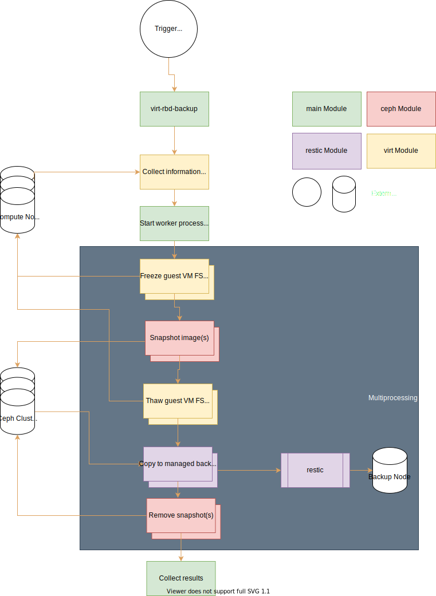

# virt-rbd-backup

[](https://www.codefactor.io/repository/github/fabian-z/virt-rbd-backup)

virt-rbd-backup makes automatic backups of virtual machines that are managed with libvirt (Hypervisor QEMU) and stored using Ceph RBD images.

Python APIs from libvirt and Ceph are used to list the relevant virtual machines, create a coordinated RBD snapshot and save the snapshot to an output module. The snapshot is removed afterwards.

Developed and tested with Python v3.9.

# Project scope

- Dynamic list of relevant libvirt virtual machines
- Create / Process / Delete RBD snapshots
- Support multiple RBD images per VM
- Output modules for external applications or backup targets (e.g. restic backup)
- If supported by guest operating system: Pause FS activity during snapshot (using libvirt API and QEMU guest agent)

# Out of scope

- Implementation of backup management
- Scheduling / Automation (external via systemd timer or cron)
- Ceph cluster configuration or management

# Architecture



# References

[libvirt Python development guide](https://libvirt.org/docs/libvirt-appdev-guide-python/en-US/html/)

[RBD Python API reference](https://docs.ceph.com/en/latest/rbd/api/librbdpy/)

# Dependencies

Both libvirt and rbd / rados Python packages should be installed with the packages providing your libvirt / Ceph distribution in order to achieve compatibility with the running virtualization and storage cluster.

It is currently assumed that the basic cluster configuration (at least mon_host and fsid) is setup in the default Ceph config file /etc/ceph/ceph.conf.

The (currently only) output module ```restic``` expects the restic executable in the search path.

# Usage

Clone the repository, rename ```config.py.example```to ```config.py``` and adjust the values to your needs.
Execute main.py for automated backups.
Currently, only ```restic``` output module is supported and the configured output repository must already be initialized.
The repository password is expected as a keyfile.

# Contributions

Contributions welcome - feel free to fork, experiment and open an issue and / or pull request.

# License

Apache License 2.0, see LICENSE
